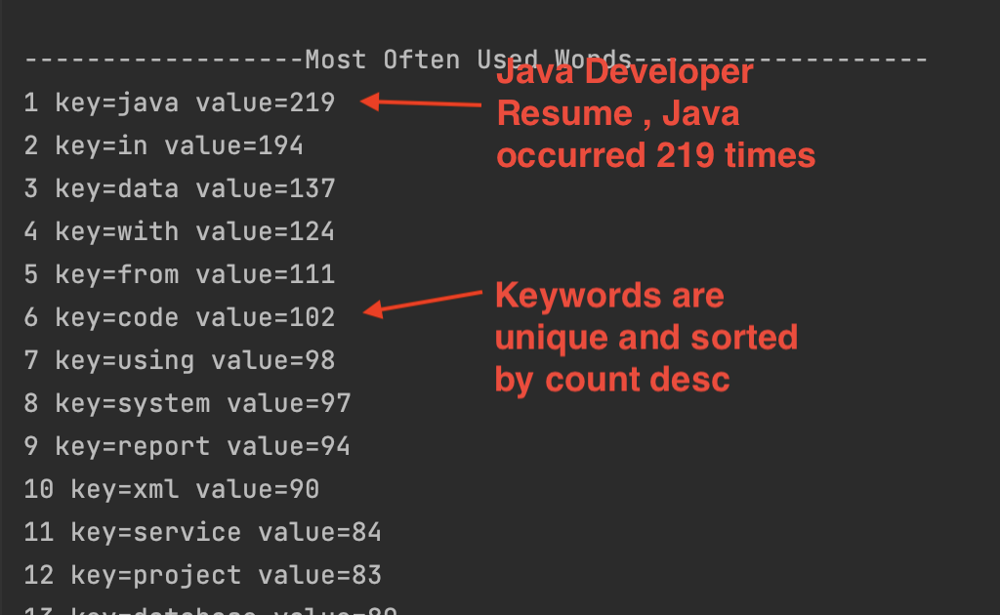
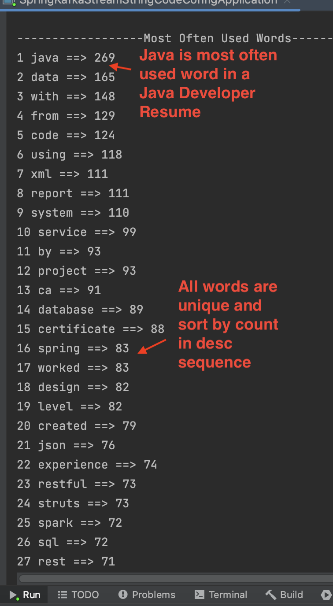

# spring-boot-kafka-stream-most-often-used-unique-word-count

### Overview
Using kafka stream toplogic transform, we usually get word-count but using KGroupedStream via SelectKey and GroupByKey then count(), we can not
avoid repeated such as Hello World Hello John, Hello Eric, produced Hello 1, world 1, Hello 2, and Eric 1 Hello 3, they can not give me Hello 3 
uniquely even reduce or aggregate can not sort by count of words during specific duration

This project used regular wordCount as everyone does to generate repeated stream and save to a topic as producer, when the consumer listen ConsumerRecord<String, Long> record, we introduce one thread to add events to blockingQueue within limit size (because hot keywords are limited) , 
Using HashMap and sorted ArrayList, we are comparing count of each keyvalue object to HashMap element, consumed all queue elements. we  save to
ArrayList and create desc sorted by count list, such that we created unique and most often used word count list

Yes as you think, this code make sense of that we try to find hotest keywords from routine kstream

### Result:

### KStream Processor
   You can see that we used regular kstream and ktable to create KTable<String,Long> wordCounts, only difference is adding the filter to filter 
   the common words we do not care and use ReplaceAll to remove other charactor except Alphabete character

        @Configuration
        @EnableKafkaStreams
        @Slf4j
        public class KafkaProcessor {

            private static final Serde<String> STRING_SERDE = Serdes.String();
            private static final Serde<Long> LONG_SERDE = Serdes.Long();
            private static List<String> ignoreList = Arrays.asList("a","the","of","for","on","at","as","it","is","are","am","have","has","all",
                                                                   "in","be","do","0","1","2","3","4","5","6","7","8","9","will","shall","and",
                                                                   "to","you","I","he","she","we","they","he","him","her");
            private static Set<String> ignoreSet = new HashSet<>(ignoreList);
            @Bean  // too slow !!!
            public KStream<String , Long> kStream(StreamsBuilder streamsBuilder) {
                KStream<String, String> kstream = streamsBuilder.stream(Constants.INPUT_TOPIC,Consumed.with(STRING_SERDE, STRING_SERDE));
                
                KTable<String,Long> wordCounts  = kstream
                           //.mapValue  Hello world Hello John Hello Jessica -->hello world hello john hello jessica
                        .mapValues(textLine -> textLine.replaceAll("[^a-zA-Z ]", "").toLowerCase())
                           //.flatMapValue  {null:hello, null:world null:hello null:john null:hello null: jessica
                        .flatMapValues(textLine -> Arrays.asList(textLine.split("\\W+")))
                           //.selectKey  {hello:hello world:world hello:hello john:john hello:hello jessica: jessica
                           .map((key, word) -> new KeyValue<>(word, word))
                           //.groupByKey  {hello:hello hello:hello hello:hello world:world  john:john jessica:jessica
                        .groupByKey(Grouped.with(Serdes.String(), Serdes.String()))
                        .count();
                        
                      KStream<String, Long> result = wordCounts.toStream().filter((k,v) ->!ignoreSet.contains(k));
                      result.to(Constants.OUTPUT_TOPIC,Produced.with(Serdes.String(), Serdes.Long()));
                      
                      return wordCounts.toStream();
            }
        }
### Consumer of wordcount kstream
   We introduce Java capability to post to process initial kstream wordcount
   1. First of All , we use a blockingQeueu to buffer the consumer keyvalue object KVCount, we only concern limitedd hottest words
   2. Created SharedBlockingQueue class to process unique key words and sort them by count on desc order
   3. Use a thread to polling the queue and sleep
    
            @Component
            @Slf4j
            @RequiredArgsConstructor
            public class WordCountConsumer {
                private final SharedBlockingQueue sharedBlockingQueue;
                @KafkaListener(topics = Constants.OUTPUT_TOPIC, groupId=Constants.CONSUMER_GROUP_ID)
                public void consume(ConsumerRecord<String, Long> record) {
                    /**
                     *  Add to BlackingQueue under the condition
                     */
                   if (sharedBlockingQueue.getSharedBlockingQueue().size()<Constants.QUEUE_SIZE) {
                       if (sharedBlockingQueue.getSharedBlockingQueue().size() > Constants.QUEUE_SIZE - Constants.QUEUE_SIZE * 0.1) {
                           if (record.value() > 1) {
                               sharedBlockingQueue.getSharedBlockingQueue().add(new KVCount(record.key(), record.value()));
                           }
                       } else {
                           sharedBlockingQueue.getSharedBlockingQueue().add(new KVCount(record.key(), record.value()));
                       }
                   }
                 }
            }
  ### KVCount key value class
     Important class for all Queue, HashMap and List 
          @Data
          @NoArgsConstructor
          @AllArgsConstructor
          public class KVCount {
              private String key;
              private Long count;
          }
 ### Related Constants
          public interface Constants {
            public final static String INPUT_TOPIC="input-topic";
            public final static String  OUTPUT_TOPIC="output-topic";
            public final static String  OUTPUT_AGGR_TOPIC="output-aggr_topic";
            public final static String CLIENT_ID_CONFIG= "wordcount-client";
            public final static String BOOTSTRAP_SERVER="localhost:9092";
            public final static String CONSUMER_GROUP_ID="my_group";
            public final static String APPLICATION_CONFIG_ID="kStream_config_test";
            
            public final static Integer QUEUE_SIZE=10000;

            public final static Integer MOST_OF_COUNT=1000;
         }
  ### SharedBlockingQueue class
      BlockingQueue to cache the kstream data, clear it every two minutes after processing data
      HashMap here is make keyword unique and keep maximum count of unique keyword
      ArrayList here is working for sort KVCount object by its count 
      Synchronized the process after sleep
      Sleep make sure the thread which uses SharedBlockingQueue class yield CPU time to other threads
      
        @AllArgsConstructor
        @NoArgsConstructor
        @Data
        @Service
        @Slf4j
        public class SharedBlockingQueue {

            private  BlockingQueue<KVCount> sharedBlockingQueue = new ArrayBlockingQueue<>(Constants.QUEUE_SIZE);
            private  List<KVCount> sortedList = new ArrayList<>();
            private Map<String, Long> countMap = new HashMap<>();

            public void sortAndRender() {
                /**
                 *   2 seconds of duration for thread really process
                 *   sleep means the thread yield CPU time to others
                 */
                try {
                    Thread.sleep(2000);
                } catch (InterruptedException e) {
                    throw new RuntimeException(e);
                }
                synchronized (sortedList) {
                    countMap.clear();
                    /**
                     *  Unique for current kvCounts by CountMap and only max count of KVCount be saved into CountMap
                     */
                    while (!sharedBlockingQueue.isEmpty()) {
                        KVCount kvCount = sharedBlockingQueue.poll();
                        String key = kvCount.getKey();
                        if (key.isEmpty() || key==null || key=="") continue;
                        Long value = kvCount.getCount();
                        if (countMap.containsKey(key)) {
                            Long count = countMap.get(key);
                            if (count<value) {
                                countMap.put(key,value);
                            }
                        } else {
                            countMap.put(key,value);
                        }
                        if (countMap.size()>Constants.MOST_OF_COUNT) break;
                     }
                    countMap.forEach((k,v)->sortedList.add(new KVCount(k,v)));

                    if (!sortedList.isEmpty()) {
                        System.out.println("\n------------------Most Often Used Words-------------------");
                        /**
                         *  Sorting by Desc
                         */
                        sortedList.sort((o1,o2)->o2.getCount().compareTo(o1.getCount()));
                        AtomicInteger sequence_of_unique_words= new AtomicInteger(1);
                        sortedList.forEach(kvCount-> System.out.println(sequence_of_unique_words.getAndIncrement()
                                                      +" "+kvCount.getKey()+" ==> "+kvCount.getCount()));
                     }
                    sortedList.clear();
                }
            }
        }
        
### Conclusion
   This project important points are post of ktable and kstream processor, make that hottest keywords are unique during two minute sampling period
   and next time show, if same words comes in, combine old data in input-topic with new data to show unique keys and their count. All keys are order
   by count and desc sequence. 
