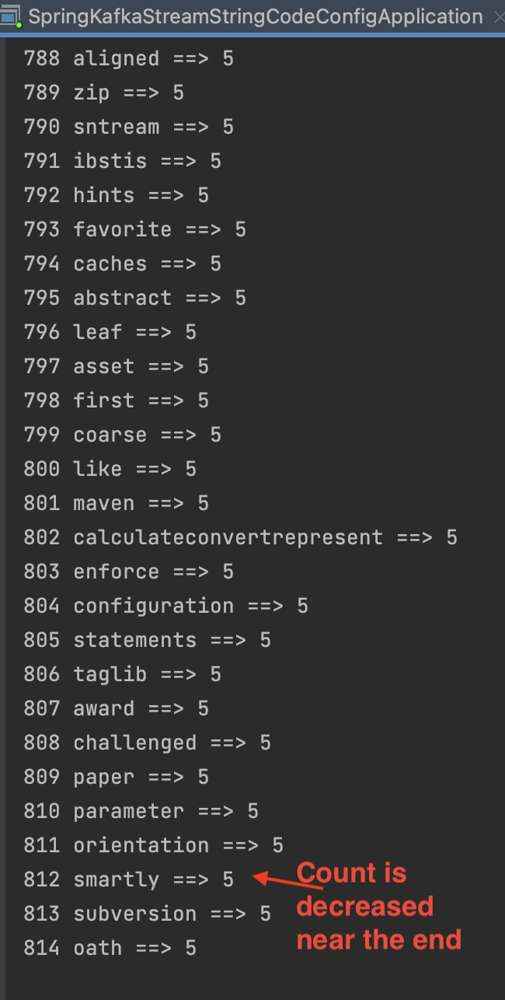

# spring-boot-kafka-stream-most-often-used-unique-word-count

### Overview
Using kafka stream toplogic transform, we usually get word-count but using KGroupedStream via SelectKey and GroupByKey then count(), we can not
avoid repeated such as Hello World Hello John, Hello Eric, produced Hello 1, world 1, Hello 2, and Eric 1 Hello 3, they can not give me Hello 3 
uniquely even reduce or aggregate can not sort by count of words during specific duration

This project used regular wordCount as everyone does to generate repeated stream and save to a topic as producer, when the consumer listen ConsumerRecord<String, Long> record, we introduce one thread to add events to blockingQueue within limit size (because hot keywords are limited) , 
Using HashMap and sorted ArrayList, we are comparing count of each keyvalue object to HashMap element, consumed all queue elements. we  save to
ArrayList and create desc sorted by count list, such that we created unique and most often used word count list

Yes as you think, this code make sense of that we try to find hotest keywords from routine kstream

### Result:

